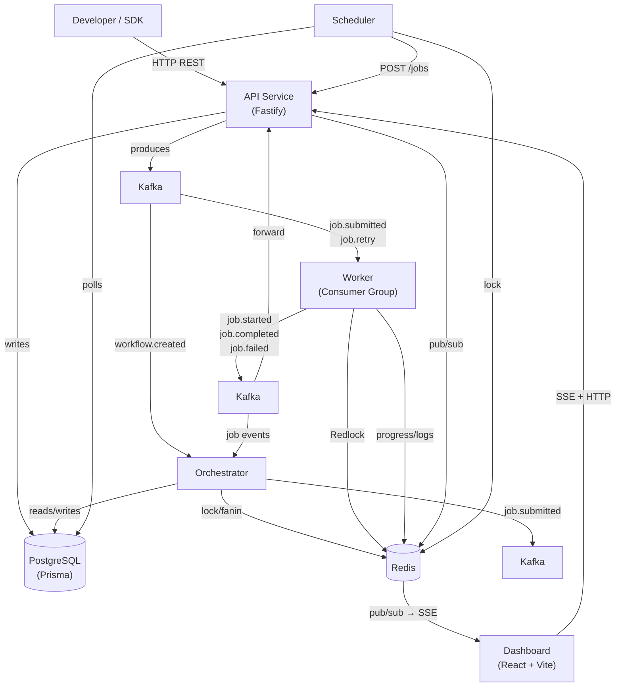
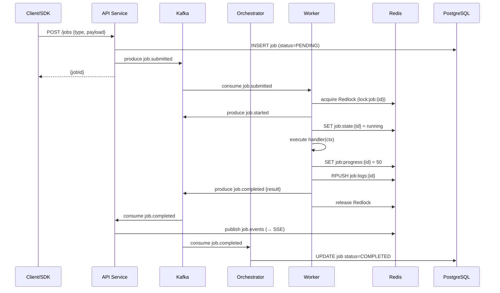
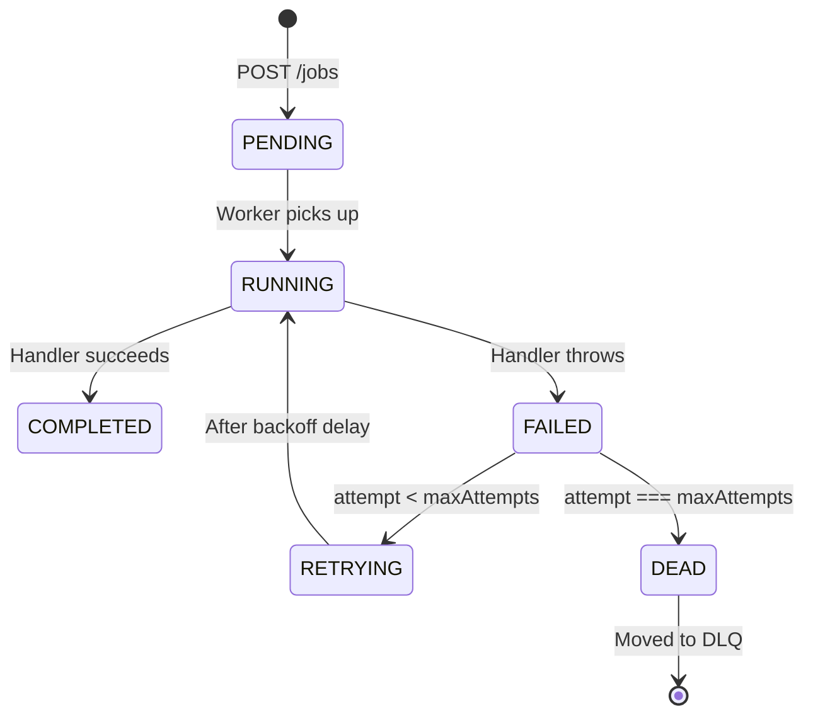

# Forge Engine

> A self-hostable, open-source **Distributed Job Scheduler & Workflow Engine** built in TypeScript.

[](https://www.typescriptlang.org/)
[](https://nodejs.org/)
[](LICENSE)
[](infra/docker-compose.yml)

Submit background jobs, chain them into multi-step workflows, schedule them with cron, and observe everything in real time — via a **typed Node.js SDK**, a clean REST API, or a live dashboard. One `docker compose up` to run the entire stack.

---

## Quick Start

**Prerequisites:** Docker + Docker Compose

```bash
git clone https://github.com/KUSHAL-31/node-forge-engine.git
cd node-forge-engine
docker compose -f infra/docker-compose.yml up -d
```

| Service | URL |
|---------|-----|
| API | http://localhost:3000 |
| Dashboard | http://localhost:5173 |
| Kafka UI | http://localhost:8080 |

Verify:
```bash
curl http://localhost:3000/health
# {"status":"ok","service":"api"}
```

> The API key is seeded from `API_KEY_SEED` in your `.env` file. The default dev value is `forge-dev-api-key-12345`.

---

## Architecture



## Event Flow



## Job State Machine



---

## SDK Usage

Install the SDK in your Node.js project:

```bash
npm install @node-forge-engine/sdk
```

### Submit a Job

```typescript
import { JobEngine } from '@node-forge-engine/sdk';

const engine = new JobEngine({
  apiUrl: process.env.API_BASE_URL,   // e.g. http://localhost:3000
  apiKey: process.env.API_KEY_SEED,   // set in your .env file
});

const { jobId } = await engine.submitJob({
  type: 'send-email',
  payload: { to: 'user@example.com', subject: 'Welcome!', body: 'Hello!' },
  retries: 3,
  backoff: 'exponential',  // 'fixed' | 'linear' | 'exponential'
  priority: 'high',         // 'low' | 'normal' | 'high' | 'critical'
  delay: 5000,              // wait 5s before first attempt
  idempotencyKey: 'welcome-email-user-42',  // safe to call multiple times
});
```

### Check Job Status

```typescript
const job = await engine.getJob(jobId);
console.log(job.status);    // 'completed'
console.log(job.progress);  // 100
console.log(job.logs);      // ['Sending email to user@example.com', 'Email sent.']
console.log(job.result);    // { sent: true }
```

### Register a Worker

Register handlers for each job type your service processes. Forge Engine handles Kafka consumption, distributed locking, retries, and progress streaming — you just write the function.

```typescript
import { Worker } from '@node-forge-engine/sdk';

const worker = new Worker();

worker
  .register('send-email', async (ctx) => {
    await ctx.log(`Sending email to ${ctx.data.to}`);
    await ctx.progress(50);
    // ... your email sending logic
    await ctx.progress(100);
    return { sent: true };
  })
  .register('charge-payment', async (ctx) => {
    await ctx.log(`Charging $${ctx.data.amount} for order ${ctx.data.orderId}`);
    // ... your payment logic
    return { charged: true };
  });

await worker.start({
  kafkaBrokers: ['localhost:9092'],
  redisHost: 'localhost',
  redisPort: 6379,
});
```

**`ctx` methods available inside any handler:**

| Method | Description |
|--------|-------------|
| `ctx.data` | The job payload |
| `ctx.jobId` | Current job ID |
| `ctx.attempt` | Current attempt number (0-indexed) |
| `await ctx.progress(n)` | Report progress 0–100, streamed live to the dashboard |
| `await ctx.log(msg)` | Append a structured log entry, visible in the dashboard |

### Sequential Workflow

Steps run in order. Each step starts only after all steps in `dependsOn` have completed.

```typescript
const { workflowId } = await engine.submitWorkflow({
  name: 'order-processing',
  steps: [
    {
      name: 'validate',
      type: 'validate-order',
      payload: { orderId: 'ORD-100' },
    },
    {
      name: 'charge',
      type: 'charge-payment',
      payload: { orderId: 'ORD-100', amount: 89.99 },
      dependsOn: ['validate'],
    },
    {
      name: 'confirm',
      type: 'send-email',
      payload: { to: 'user@example.com', subject: 'Order confirmed' },
      dependsOn: ['charge'],
    },
  ],
  onFailure: {
    type: 'send-email',
    payload: { to: 'ops@company.com', subject: 'Order pipeline failed' },
  },
});
```

```
validate → charge → confirm
           ↓ (if fails permanently)
        onFailure: send-email (ops alert)
```

### Parallel Fan-out / Fan-in

Steps with the same `parallelGroup` run simultaneously. A downstream step waits for all of them to complete before starting (fan-in).

```typescript
await engine.submitWorkflow({
  name: 'post-payment-parallel',
  steps: [
    {
      name: 'charge',
      type: 'charge-payment',
      payload: { orderId: 'ORD-200', amount: 199.99 },
    },
    {
      name: 'notify-warehouse',
      type: 'notify-warehouse',
      payload: { orderId: 'ORD-200' },
      dependsOn: ['charge'],
      parallelGroup: 'fulfillment',
    },
    {
      name: 'update-inventory',
      type: 'update-inventory',
      payload: { orderId: 'ORD-200' },
      dependsOn: ['charge'],
      parallelGroup: 'fulfillment',
    },
    {
      name: 'send-receipt',
      type: 'send-email',
      payload: { to: 'user@example.com', subject: 'Your receipt' },
      dependsOn: ['notify-warehouse', 'update-inventory'], // fan-in: waits for both
    },
  ],
});
```

```
          charge
            │
  ┌─────────┴─────────┐
notify-warehouse  update-inventory
  [fulfillment]   [fulfillment]
  └─────────┬─────────┘
       send-receipt
```

### Cron Schedule

```typescript
await engine.createSchedule({
  name: 'nightly-cleanup',
  type: 'cron',
  cronExpr: '0 2 * * *',   // every day at 02:00
  jobType: 'cleanup-sessions',
  payload: { olderThanDays: 30 },
});
```

### One-Shot Schedule

```typescript
await engine.createSchedule({
  name: 'black-friday-campaign',
  type: 'one_shot',
  runAt: '2026-11-27T00:00:00Z',
  jobType: 'send-email',
  payload: { to: 'subscribers@company.com', subject: 'Black Friday is LIVE!' },
});
```

### Manage Schedules

```typescript
// List all schedules
const schedules = await engine.listSchedules();

// Pause a schedule
await engine.updateSchedule(scheduleId, { active: false });

// Reactivate
await engine.updateSchedule(scheduleId, { active: true });

// Delete
await engine.deleteSchedule(scheduleId);
```

---

## REST API

If you're not using the SDK, every feature is available over HTTP. Load your env vars once:

```bash
export FORGE_KEY=$(grep API_KEY_SEED .env | cut -d '=' -f2)
export FORGE_URL="http://localhost:3000"
```

### Submit a Job

```bash
curl -X POST $FORGE_URL/jobs \
  -H "Authorization: Bearer $FORGE_KEY" \
  -H "Content-Type: application/json" \
  -d '{
    "type": "send-email",
    "payload": { "to": "user@example.com", "subject": "Hello" },
    "retries": 3,
    "backoff": "exponential",
    "priority": "high"
  }'
# {"jobId":"4029e1c0-..."}
```

### Submit a Workflow

```bash
curl -X POST $FORGE_URL/workflows \
  -H "Authorization: Bearer $FORGE_KEY" \
  -H "Content-Type: application/json" \
  -d '{
    "name": "order-pipeline",
    "steps": [
      {
        "name": "validate",
        "type": "validate-order",
        "payload": { "orderId": "ORD-1" }
      },
      {
        "name": "charge",
        "type": "charge-payment",
        "payload": { "orderId": "ORD-1", "amount": 99 },
        "dependsOn": ["validate"]
      }
    ]
  }'
```

### Create a Cron Schedule

```bash
curl -X POST $FORGE_URL/schedules \
  -H "Authorization: Bearer $FORGE_KEY" \
  -H "Content-Type: application/json" \
  -d '{
    "name": "daily-report",
    "type": "cron",
    "cronExpr": "0 8 * * *",
    "jobType": "generate-report",
    "payload": { "format": "pdf" }
  }'
```

### DLQ — Inspect, Replay and Delete

```bash
# List dead-lettered jobs
curl $FORGE_URL/dlq \
  -H "Authorization: Bearer $FORGE_KEY"

# Replay as a fresh attempt (attempt counter reset to 0)
curl -X POST $FORGE_URL/dlq/{id}/replay \
  -H "Authorization: Bearer $FORGE_KEY"

# Delete permanently
curl -X DELETE $FORGE_URL/dlq/{id} \
  -H "Authorization: Bearer $FORGE_KEY"
```

### Resume a Failed Workflow

```bash
curl -X POST $FORGE_URL/workflows/{workflowId}/resume \
  -H "Authorization: Bearer $FORGE_KEY"
```

Completed steps are not re-run. Only failed and pending steps are retried from where the workflow left off.

### Full API Reference

All endpoints require `Authorization: Bearer {apiKey}`.

| Method | Endpoint | Description |
|--------|----------|-------------|
| `GET` | `/health` | Health check |
| `POST` | `/jobs` | Submit a background job |
| `GET` | `/jobs` | List jobs |
| `GET` | `/jobs/:id` | Get job — status, progress, logs, result |
| `POST` | `/workflows` | Submit a workflow |
| `GET` | `/workflows` | List workflows |
| `GET` | `/workflows/:id` | Get workflow + all step statuses |
| `POST` | `/workflows/:id/resume` | Resume a failed workflow |
| `GET` | `/dlq` | List dead letter queue |
| `POST` | `/dlq/:id/replay` | Replay a DLQ entry (attempt reset to 0) |
| `DELETE` | `/dlq/:id` | Delete a DLQ entry |
| `GET` | `/schedules` | List all schedules |
| `POST` | `/schedules` | Create a cron or one-shot schedule |
| `PATCH` | `/schedules/:id` | Update schedule (expression, payload, active state) |
| `DELETE` | `/schedules/:id` | Delete a schedule |
| `GET` | `/workers` | List workers with heartbeat and job types |
| `GET` | `/events` | SSE stream — live job and workflow events |

---

## Dashboard

React SPA at `http://localhost:5173`. Connects to the SSE stream on load — all views update in real time.

| View | Path | What it shows |
|------|------|---------------|
| **Jobs** | `/jobs` | Live list of all jobs with status, progress, and attempts. Click a row for full detail — logs, progress bar, result, and error. |
| **Workflows** | `/workflows` | All workflows with step count. Click for a live step dependency graph — nodes colour-shift as steps run. |
| **Schedules** | `/schedules` | All cron and one-shot schedules. Create, pause, reactivate, or delete from this view. |
| **Dead Letter Queue** | `/dlq` | Jobs that exhausted all retries. Expand for full error history. Replay or delete entries directly. |
| **Workers** | `/workers` | Registered worker instances with heartbeat status and which job types each one handles. |

---

## Features

- **Jobs** — retries with fixed/linear/exponential backoff, priority queues, delayed execution, idempotency keys
- **Workflows** — sequential (`dependsOn`), parallel fan-out (`parallelGroup`), fan-in, `onFailure` handler, resume without re-running completed steps
- **Scheduling** — cron + one-shot, distributed lock ensures exactly one fire per tick across replicas
- **DLQ** — automatic on retry exhaustion, full error history, one-call replay
- **Real-time** — SSE stream for all job/workflow events, live progress and log streaming
- **Security** — SHA-256 hashed API keys, 1000 req/min rate limiting per key via Redis sliding window
- **Scale** — Kafka consumer groups for horizontal worker scaling, Redlock for exactly-once execution, Kubernetes Helm chart included

---

## Tech Stack

| Component | Technology | Why |
|-----------|------------|-----|
| Language | TypeScript 5 / Node.js 20 | Single language across all services |
| API Framework | Fastify | Lower overhead than Express; built-in JSON schema validation |
| Message Bus | Apache Kafka (KafkaJS) | Consumer groups for load balancing; event retention for replay; multiple services consume the same events independently |
| Distributed Locks | Redis + Redlock | Fast cross-process mutex; handles horizontal scale correctly; lock expiry prevents deadlocks on worker crash |
| Job State Cache | Redis (ioredis) | Sub-millisecond reads for progress and logs without hitting Postgres on every poll |
| Pub/Sub (SSE) | Redis pub/sub | Push job events to dashboard SSE clients instantly when state changes |
| Database | PostgreSQL (Prisma) | ACID guarantees; durable source of truth; relational step dependency resolution |
| Dashboard | React + Vite | SPA with SSE-driven live updates; no server-side rendering needed |
| Monorepo | Turborepo | Parallel builds; shared packages compiled once and reused across all services |
| Local Dev | Docker Compose | One command to run entire stack including all infrastructure |
| Production | Kubernetes + Helm | Independent scaling per service; HPA for workers based on Kafka consumer lag |

---

## Project Structure

```
node-forge-engine/
├── apps/
│   ├── api/            # Fastify REST API + SSE + Kafka consumers
│   ├── orchestrator/   # Workflow state machine and step resolver
│   ├── worker/         # Job execution engine with Redlock
│   ├── scheduler/      # Cron poll loop with distributed lock
│   └── dashboard/      # React + Vite SPA (5 views)
├── packages/
│   ├── sdk/            # Public SDK — JobEngine and Worker classes
│   ├── types/          # Shared TypeScript types and Kafka event interfaces
│   ├── kafka/          # KafkaJS client and typed producer
│   ├── redis/          # ioredis client, Redlock, key builders
│   └── prisma/         # Schema, migrations, audit log helper
└── infra/
    ├── docker-compose.yml   # Full stack in one command
    ├── dockerfiles/         # Multi-stage Dockerfiles per service
    └── helm/                # Kubernetes Helm chart with HPA for workers
```

---

## FAQ

**How do I add a new job type?**
Register a handler in `apps/worker/src/handlers/` and add it to the handlers Map in `apps/worker/src/index.ts`. With the SDK: `worker.register('my-type', async (ctx) => { ... })`. No schema changes needed.

**What happens if a worker crashes mid-job?**
The Kafka consumer group rebalances and the message is re-delivered to another worker. The Redlock TTL (30s) expires, so the new worker acquires the lock and executes the job without duplication.

**What happens if Kafka goes down?**
Forge Engine writes to Postgres before producing to Kafka. The job record already exists and can be requeued on Kafka recovery. Postgres is always the source of truth.

**Can I run multiple worker instances?**
Yes. Kafka consumer groups distribute jobs across replicas automatically. Redlock ensures only one worker executes a given job at a time.

**Is there a Python or Go SDK?**
No — intentionally Node.js/TypeScript only. The REST API is language-agnostic so any HTTP client works.

**Can I host this on Kubernetes?**
Yes. The `infra/helm/` chart deploys all services with a HorizontalPodAutoscaler for workers. Use managed Redis and Postgres (e.g. AWS ElastiCache + RDS) in production.

---

## Contributing

1. Fork the repo and create a branch: `git checkout -b feat/your-feature`
2. Follow commit convention: `feat(scope): description`
3. Submit a Pull Request

---

## License

MIT
